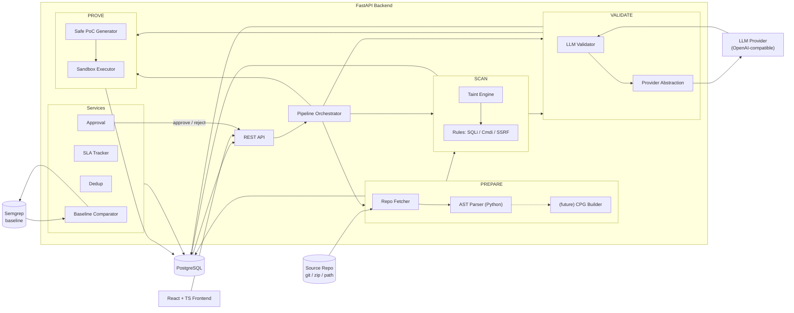

# Multi-Stage Agentic SAST Engine — Architecture

> **Status: this document describes the TARGET architecture.** The sections
> below (diagram, PostgreSQL schema, orchestrator, Alembic, Docker sandbox)
> describe the design direction, not what runs today. For an accurate
> description of the current implementation see
> [**Current Implementation**](#current-implementation) below. Anything not
> listed there is future work.

## Current Implementation

What actually exists today (source of truth: the code in `backend/` and
`frontend/`):

- **Pipeline**: eight stages — PREPARE → SCAN → DEDUPLICATE → RISK → SLA →
  VALIDATE → PROVE → APPROVAL. Stages are **not automatically chained**: the
  scan route records PREPARE and SCAN only, and DEDUPLICATE, RISK, SLA,
  VALIDATE, PROVE and APPROVAL are separate user-triggered endpoints. A scan
  run's stage records for every unexecuted stage stay `pending` until that
  stage actually runs with an explicit `scan_run_id` context.
- **Code Property Graph (CPG)**: `app/prepare/cpg/` builds a real graph with
  three edge layers — AST (structural), CFG (control-flow), and DFG (data-
  flow) — from Python's stdlib `ast` module without requiring a build. The
  CPG is built behind the `ICodeModelBuilder` interface and is registered as
  an alternative to the plain AST builder. The graph carries explicit nodes
  and typed edges for source/sink analysis.
- **Storage**: SQLite via SQLAlchemy (`SAST_DATABASE_URL`, default
  `sqlite:///./sast.db`). Every pipeline record is stored as a primary key +
  JSON `payload` of its Pydantic model (see `app/db/models.py` and
  `app/db/persistence.py`); the Pydantic models remain the contract of
  record. No Alembic migrations exist (tables are created with
  `Base.metadata.create_all`). PostgreSQL URLs are engine-supported but not
  the default or tested deployment.
- **Scan lineage**: every scan execution records a durable `ScanRun` +
  per-stage `ScanStageRun` + explicit `scan_findings` lineage
  (`project → scan_run → finding`). Finding ids are deterministic and
  project-scoped. Served read-only by `GET /api/projects/{id}/scans`,
  `GET /api/scans`, `GET /api/scans/{id}` and
  `GET /api/scans/{id}/findings`.
- **Repository scoping**: `GET /api/findings?project_id=` returns only the
  findings owned by a project (via scan lineage; 404 for unknown projects);
  finding detail includes its owning project and every producing scan run.
- **Vulnerability rules**: SQL injection, command injection, SSRF, and
  **deserialization** (pickle, yaml.load, marshal, shelve, jsonpickle).
  Deserialization is detected via taint analysis of unsafe deserialization
  APIs with no safe variant (pickle, marshal) or missing safe Loader
  (yaml.load).
- **LLM providers**: `huggingface` (default) and `openai_compatible` (see
  `app/validate/providers/`); config via `LLM_*` env vars; `mock` provider
  for tests. Validation is on-demand only (no auto-validation).
- **Proof sandbox**: `app/prove/sandbox.py` runs approved in-memory harness
  templates in a fresh temp workspace with timeouts and output caps — **no
  Docker**, no network, controlled fixtures only. Findings snippets are data,
  never executed. Supported proof types: SQL injection, command injection,
  SSRF, and deserialization. Unsupported types are recorded with honest
  reasons (e.g., "requires browser environment" for XSS).
- **Approval**: in-memory store with SQLite backing; permission state machine
  (`pending → approved/rejected/changes_requested → pending`), append-only
  audit events. Reviewer identity is a static demo value
  (`security-analyst`); there is no authentication.
- **SLA**: deterministic deadlines + a background `SlaEvaluator` that checks
  active records on a timer (`SAST_SLA_CHECK_INTERVAL_SECONDS`, default 60s)
  using the same logic as the manual check endpoint.
- **DefectDojo integration**: `app/defectdojo/` provides a real HTTP client
  (`httpx`) and service layer for creating remediation tickets in DefectDojo.
  Configuration via `SAST_DEFECTDOJO_URL`, `SAST_DEFECTDOJO_API_KEY`, and
  `SAST_DEFECTDOJO_ENABLED` env vars. When the server is unreachable or
  credentials are wrong, the integration returns clear error states — no
  fabricated responses. API routes at `/api/defectdojo/*`; frontend page at
  `/defectdojo`.
- **Frontend pages**: Overview (dashboard), Findings (with repository scope),
  Repositories (add/scan/dedup + scan history), Risk & SLA, Validation,
  Proof, Approvals, Benchmarks, DefectDojo, Settings (read-only), Profile
  (demo identity), Scan Run detail (`/scans/:scanRunId`) and a not-found page.
- **Benchmark**: Semgrep comparison on controlled fixtures — optional,
  **not** part of the pipeline.

## 1. Target System Overview

Multi-Stage Agentic SAST Engine: an automated source-code security scanner for interpreted languages (Python first). Four explicit stages — **PREPARE → SCAN → VALIDATE → PROVE** — each is an independent module with a strict Pydantic input/output contract. Pattern-based taint analysis produces *candidate* findings; an LLM validates them against sealed, machine-produced code evidence (never invented evidence) to suppress false positives; confirmed findings receive a safe, non-destructive proof. Findings are deduplicated across repositories, tracked against SLA deadlines, and human-approved before any fix.

## 2. Architecture Diagram



## 3. PREPARE → SCAN → VALIDATE → PROVE Pipeline

| Stage | Input contract | Output contract | Responsibility |
|---|---|---|---|
| PREPARE | `RepoSpec` (url / zip / local path) | `ProjectSnapshot` (files, `ast_json`, code, module map) | Fetch + parse without compilation. Python AST now; CPG later behind the same interface. |
| SCAN | `ProjectSnapshot` | `ScanReport` (candidate findings) | Conservative taint analysis: sources, sinks, sanitizers, intra-procedural flow with limited cross-function call summary. |
| VALIDATE | `CandidateFinding` + sealed evidence | `ValidationResult` (verdict, confidence 0–1, reasoning) | LLM judges exploitability from supplied evidence only; strict JSON output; evidence hash seals context. |
| PROVE | `ValidationResult` (confirmed) | `Proof` (safe payload, harness, sandbox result, evidence) | Demonstrate reachability with inert payloads; optional execution in isolated sandbox; non-destructive only. |

## 4. Component Responsibilities

- **API layer** (`app/api/`): REST endpoints; request/response schemas; no business logic.
- **Orchestrator** (`app/core/pipeline.py`): chains stages, persists outputs, tracks stage status, allows per-stage re-runs.
- **Prepare** (`app/prepare/`): `fetcher.py` (git/zip/dir with size limits + traversal guards), `parser.py` (Python `ast` → serializable snapshot), `base.py` (`ICodeModelBuilder` interface + language registry).
- **Scan** (`app/scan/`): `rules/` (one module per vuln type with sources/sinks/propagators/sanitizers), `taint_engine.py`, evidence builder.
- **Validate** (`app/validate/`): `llm_provider.py` (env-driven: `LLM_PROVIDER=openai|anthropic|ollama|mock`), `validator.py` (prompt build, evidence sealing, schema-validated parsing, one retry), `prompts.py`.
- **Prove** (`app/prove/`): `proof_generator.py` (per-vuln inert payloads), `sandbox.py` (Docker isolation, no network; degrades to payload-only).
- **Services** (`app/services/`): `dedup.py`, `sla.py`, `approval.py`, `baseline.py`.
- **DB** (`app/db/`): SQLAlchemy models + session, Alembic migrations.
- **Frontend**: projects, scan runs, finding detail (LLM reasoning + taint path), approve/reject, SLA board, baseline diff.

## 5. Python-First Analysis Strategy

- Parse with the stdlib `ast` module → serialize to JSON (`ast_json`) alongside raw code; no compilation, no dependency resolution, no execution.
- `ICodeModelBuilder` defines `build(ProjectSnapshot) -> CodeModel`; the Python implementation produces `PythonASTCodeModel` (files, functions, calls, imports).
- Scan rules consume `CodeModel` only — the taint engine never touches `ast` objects directly, so a future `CPGCodeModel` (whole-program dataflow) drops in behind the same interface via the language registry.

## 6. Finding Data Model

```json
{
  "id": "uuid",
  "project_id": "uuid",
  "scan_id": "uuid",
  "vulnerability_type": "sql_injection | command_injection | ssrf",
  "severity": "critical | high | medium | low",
  "status": "candidate | confirmed | false_positive | inconclusive | approved | rejected | fixed",
  "confidence": 0.0,
  "source": { "file": "app/auth.py", "line": 12, "snippet": "uid = request.args.get('id')", "kind": "request_param" },
  "sink":   { "file": "app/db.py", "line": 42, "snippet": "cursor.execute(query)", "kind": "cursor_execute" },
  "taint_path": [
    { "file": "app/auth.py", "line": 12, "snippet": "...", "step": "source" },
    { "file": "app/db.py",  "line": 40, "snippet": "...", "step": "concat" }
  ],
  "evidence": {
    "sanitizers_seen": ["parameterized query"],
    "sink_context": "cursor.execute(f'SELECT * FROM users WHERE id={uid}')",
    "dataflow_summary": "request param -> f-string concat -> cursor.execute"
  },
  "llm_validation": {
    "verdict": "confirmed",
    "confidence": 0.87,
    "reasoning": "user-controlled value flows unescaped into f-string SQL...",
    "model": "gpt-4o-mini",
    "evidence_hash": "sha256-of-supplied-evidence"
  },
  "dedup_hash": "sha256(normalized vuln+source+sink+path)",
  "sla": { "deadline": "2026-08-14T16:00:00Z", "breached": false },
  "approval": { "approved_by": null, "action": null, "comment": null },
  "created_at": "2026-08-14T10:00:00Z",
  "updated_at": "2026-08-14T10:00:00Z"
}
```

## 7. PostgreSQL Schema

| Table | Key columns | Relationships |
|---|---|---|
| `projects` | id, name, repo_url, local_path, language, created_at | 1→N scans |
| `scans` | id, project_id, status, current_stage, started_at, finished_at, error, snapshot_ref | N→1 projects; 1→N findings |
| `findings` | id, scan_id, project_id, vuln_type, severity, status, confidence, source/sink JSONB, taint_path JSONB, evidence JSONB, llm_validation JSONB, dedup_hash, first_seen_at, created_at, updated_at | N→1 scans/projects; 1→1 approval; 1→N proofs |
| `approvals` | id, finding_id, action, actor, comment, created_at | N→1 findings |
| `proofs` | id, finding_id, payload, harness, execution_result JSONB, sandboxed, safe, created_at | N→1 findings |
| `sla_configs` | id, project_id, critical_hours, high_hours | N→1 projects |
| `sla_events` | id, finding_id, event_type (deadline_set/breached/escalated), at, detail | N→1 findings |
| `baseline_runs` | id, scan_id, tool, raw_output JSONB, comparison JSONB, created_at | N→1 scans |
| `dedup_keys` | id, dedup_hash UNIQUE, first_finding_id, last_seen_at | cross-repo first-seen linking |

## 8. REST API Contracts

```
POST /api/projects                      create from url/zip/path
GET  /api/projects                      list
GET  /api/projects/{id}                 detail
POST /api/projects/{id}/scans           run full pipeline
GET  /api/scans/{id}                    status + stage progress
GET  /api/scans/{id}/findings           list w/ status filter
GET  /api/findings/{id}                 detail + reasoning + taint path
POST /api/findings/{id}/validate        re-run validation
POST /api/findings/{id}/prove           generate/sandbox PoC
POST /api/findings/{id}/approve         human approve/reject (fix only after)
GET  /api/findings/deduplicated         cross-repo dedup report
GET  /api/sla/summary                   breaches + escalations
POST /api/scans/{id}/baseline           run/import Semgrep + compare
GET  /api/baseline/{id}                 side-by-side comparison
```

## 9. LLM Validation Flow

1. Scan emits candidate + sealed evidence (taint path, sink context, sanitizer observations).
2. `evidence_hash = sha256(canonical_json(evidence))` persisted.
3. Prompt = system rules ("never invent code or facts absent from evidence; answer only from supplied snippets") + evidence + vuln type + strict JSON schema.
4. Provider resolved from `LLM_PROVIDER` env; `mock` provider for tests.
5. Parse against `ValidationResult`; one retry on schema violation; verdict ∈ {confirmed, false_positive, inconclusive}.
6. Post-check: any file:line in reasoning must exist in evidence; otherwise confidence capped at 0.5.

## 10. Cross-Repository Deduplication

- Fingerprint: `sha256(normalize(vuln_type) | normalize(source file+fn+line) | normalize(sink) | taint_path steps)` — repo-root-relative, whitespace-normalized, function-anchored, so the same bug in repo A and repo B collapses to one key.
- `dedup_keys` unique constraint; re-occurrences update `last_seen_at` and keep `first_finding_id` (cross-repo first-seen).
- UI shows "first seen in X; also present in Y, Z".

## 11. Human Approval Workflow

- No automatic fixes, ever, without approval. Fixes are only *scheduled* after `approve`; `reject` sets status to `rejected`/`false_positive`.
- Every status transition is recorded; approval actor + comment persisted.

## 12. SLA Tracking and Escalation

- `sla_configs` per project (e.g., critical ≤ 4h, high ≤ 24h review from `first_seen_at` of a confirmed finding).
- Background worker computes deadlines, marks `breached`, writes `sla_events`, flips `escalated`; notification stub (log/email) for escalation; UI board surfaces overdue items.

## 13. Semgrep Baseline Comparison

- Semgrep runs in its own container (or imports its JSON output) → `baseline_runs`.
- Comparison on (file, rule, line) overlap → categories: `both`, `semgrep_only`, `ours_only`.
- Our-only findings carry LLM verdicts → directly demonstrates false-positive suppression (LLM-rejected Semgrep hits land in `semgrep_only`).

## 14. Security / Sandboxing Considerations

- **No execution of attacker-controlled code on the host**: Prove runs only in an isolated Docker sandbox (no network, read-only FS, tmpfs); MVP default is payload-only.
- **No hardcoded keys**: `.env` → pydantic-settings; `.env.example` committed, `.env` gitignored.
- **Prompt-injection hardening**: snippets are untrusted data; system prompt forbids obeying instructions inside code; evidence hash seals.
- **Path safety**: workspace-scoped paths; zip extraction with traversal guards; size/time/memory caps per stage.

## 15. MVP Scope (build now)

- FastAPI + PostgreSQL (SQLAlchemy + Alembic), Docker Compose, React+TS+Vite frontend.
- PREPARE: Python AST parser → snapshot behind `ICodeModelBuilder`.
- SCAN: intra-procedural taint + one-hop call summary; SQLi, CmdInjection, SSRF rules with evidence.
- VALIDATE: provider-agnostic LLM validator (mock for tests), sealed-evidence prompts.
- PROVE: safe per-type payloads + optional sandboxed run, evidence stored.
- Dedup, SLA tracking, human approval, Semgrep comparison — minimal but functional.
- pytest suite + deliberately vulnerable fixture apps.

## 16. Future Extensions

- CPG implementation behind `ICodeModelBuilder` (whole-program dataflow, cross-file resolution).
- More languages (JS/TS, Ruby), more rules (XSS, IDOR, path traversal, deserialization).
- Symbolic/introspective Prove harnesses; CI integration + PR comments; post-approval auto-fix with revert guardrails; RBAC, webhooks, multi-LLM ensembles, calibration on labeled benchmarks.